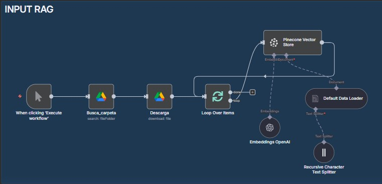
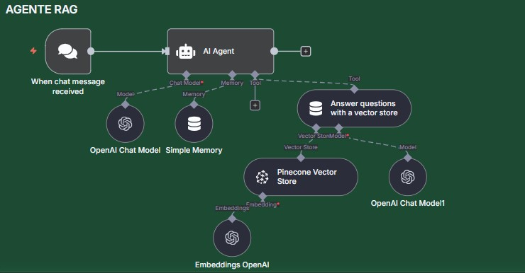

# n8n-rag-workflow 🤖🔗 

Proyecto de **Retrieval Augmented Generation (RAG)** implementado en **n8n**.  
En este caso uso como ejemplo un documento ficticio de **políticas de devolución de una empresa** para mostrar cómo transformarlo en un **sistema de consulta tipo chatbot**.  

👉 Este proyecto complementa otro que realicé en **LangChain (Python)**, pero acá muestro cómo armarlo con una herramienta **no-code**, acercando la misma lógica de RAG a un entorno más accesible y visual.  

El proyecto en Python también está disponible en mi portfolio y podés verlo en [**rag-proyecto**](./portfolio/projects/rag-proyecto).

---

## 🚀 Descripción
Este repositorio contiene dos workflows principales en **n8n**:

1. **Carga de documentos (Input RAG Workflow)**  
   - Toma **todos los documentos** disponibles en una carpeta de Google Drive (`demo-rag`).  
   - Los divide en *chunks* de texto.  
   - Genera **embeddings** usando el modelo `text-embedding-3-small` de OpenAI.  
   - Guarda los embeddings en un índice de **Pinecone**.

2. **Agente de consultas (Agente RAG)**  
   - Recibe preguntas del usuario.  
   - Busca contexto en Pinecone.  
   - Genera respuestas usando un modelo de OpenAI (ej: `gpt-4o`), enriquecidas con la información del documento.

---

## 📁 Contenido
- `README.md` → Documentación principal del proyecto.  
- `LICENSE` → Archivo con la licencia del proyecto.  
- `workflows/` → JSON + Diaframas de los dos workflows de n8n.
- `docs/` → Documento de ejemplo (para subir a Drive).  
- `outputs/` → Ejemplos de consultas y respuestas generadas.  

---

## ⚙️ Requisitos
- [n8n](https://n8n.io/) instalado (local o en la nube).  
- API Key de **OpenAI** (para embeddings y respuestas).  
  - Es necesario contar con crédito en OpenAI.  
  - El costo de este tipo de tareas es **muy bajo**.  
- API Key de **Pinecone** (para la base vectorial).  
- Credenciales de **Google Drive** (para acceder a la carpeta `demo-rag`).  

---

## 🛠️ Tecnologías usadas
- **n8n** → orquestación de workflows no-code  
- **OpenAI** → embeddings y generación de respuestas  
- **Pinecone** → base de datos vectorial  
- **Google Drive** → almacenamiento de documentos de entrada  

---

## 🛠️ Configuración

### 1. Crear índice en Pinecone

1. Crear cuenta en [Pinecone](https://www.pinecone.io/).  
2. Generar un nuevo índice (este proyecto usa: **`demo-rag`**).  
3. Seleccionar el modelo de embeddings de OpenAI:  
   - Recomendado: **`text-embedding-3-small`** (suficiente y más económico).  
4. Cambiar manualmente la **Dimension** a **1536** (aunque Pinecone sugiera 512 por defecto).  
5. Aceptar la configuración para finalizar la creación del índice.  

### 2. Configurar credenciales en n8n
En **n8n** es necesario configurar:  
- **OpenAI API Key** → para embeddings y respuestas.  
- **Pinecone API Key** → para conexión con la base vectorial.  
- **Google Drive** → acceso a la carpeta `demo-rag` que contiene los documentos ficticios de políticas de devolución.  

### 3. Importar workflows
- Importar el JSON de **Imput_rag**.  
- Importar el JSON del **Agente_rag**.  

---

## ▶️ Uso
1. Colocar uno o varios documentos en la carpeta de Google Drive: **`demo-rag`**.  
2. Ejecutar el Workflow **Input_rag**:  
   - Extrae todos los documentos desde Drive.  
   - Los procesa en chunks.  
   - Genera embeddings con OpenAI.  
   - Inserta los embeddings en Pinecone.  
3. Lanzar el **Agente RAG** y probar preguntas como:  
   - “¿Cuál es el plazo máximo para devolver un producto?”  
   - “¿Qué documentos necesito para gestionar una devolución?”  
   - “¿Las devoluciones tienen costo para el cliente?”  

---

## 📌 Ejemplo de aplicación
Este proyecto muestra cómo un RAG puede servir para:  
- 🤝 Chatbots internos de soporte.  
- 📚 Consultas rápidas a manuales, políticas o reglamentos.  
- 🛒 Bots de atención al cliente en e-commerce.  

---

## 🖼️ Diagrama del flujo

